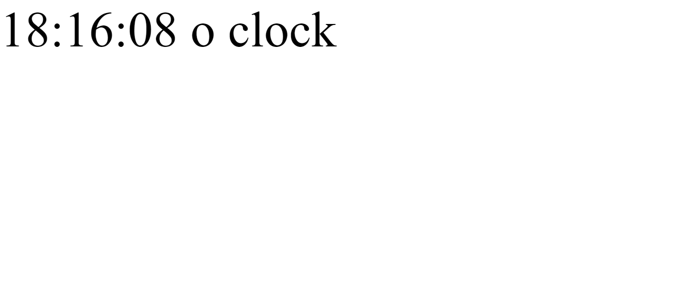

# Lab 2

## Tutorials

### Tutorial 1: Dynamic Web with Javascript

I learned about how to use Javascript, so I made a change so that every second the "o clock" text changes, randomly picked from a list containing other strings like "the time is" and "it is now" so the time is formatted as a sentence.

### Tutorial 2: Introduction to Web APIs

I learned how to call a REST API and get back JSON data, and I learned about API keys and how I can use them to authenticate myself with other people's APIs to get data from the web. This may include financial data, or the weather, or some other data. I also learned how there are limits in place to prevent abuse.

## Challenges

### Challenge 1: What time is it?

Here is my CodePen: https://codepen.io/gideontong/pen/BawgRGL

* The CodePen project has a slider with 5 timezones.
* When the slider is moved, it matches the current time in that city.
* The additional feature that is implemented is the current location's timezone is shown in text.
* An additional feature is added where the text disappears once you start moving the slider.

### Challenge 2: JSON to the Moon

Here is my CodePen: https://codepen.io/gideontong/pen/zYEVwQM

* The project has an input box for a user to enter a ticker.
* It has a button to submit the symbol.
* It has a container that includes company name and price. It also has information about the market cap and the exchange it is listed on.
* The API call is made using JS.
* Bonus feature: you can change the API key used to make the call.
* Bonus feature: it will detect when you make an invalid call and give you the error, including if the ticker doesn't exist.
