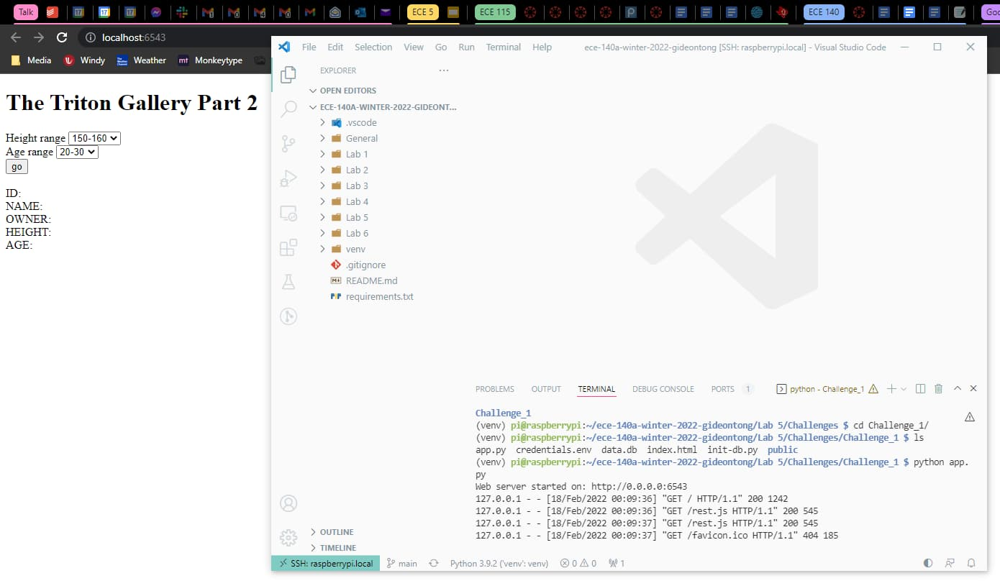

# Lab 6

> Gideon Tong (PID: A15960885)
> Sirisha Munukutla

*Passwords:*

* Raspberry Pi: `140labzzz!`
* MariaDB: `labsql3`

## Tutorials

### Tutorial 1: Setup Raspberry Pi

In this tutorial I learned how to connect my Raspberry Pi to the computer and use it to set up basically another computer and use it while on my laptop!

### Tutorial 2: Basic I/O on the Raspberry Pi

In this tutorial I learned how to connect to and read sensors on the Raspberry Pi, by connecting it to a breakout with GPIO pins. I was able to access this data on the Pi and import it into Python.

## Challenges

### Midterm

Video demo: https://youtu.be/BTr7RGAIpWY

Setup guide:

* Connect ultrasonic sensor to GPIO pins 23 and 24, and accerlometer to I2C connection.
* Run `python setupdb.py`
* Run `python collector.py` and background the task
* Run `python server.py` and background the task
* View server on `localhost:6543` if on shared IP as computer you are connecting from.

1. Sensor data is collected from the ultrasonic sensor (HC-SR04) and accelrometer (MPU6050). Data limited to collecting every 1 second.
2. You can ping the RESTful route `/value` to get the latest value.
3. You can select on the webpage between which sensor to show.
4. The LED lights up whenever the sensor is being polled (approximately once per second).
