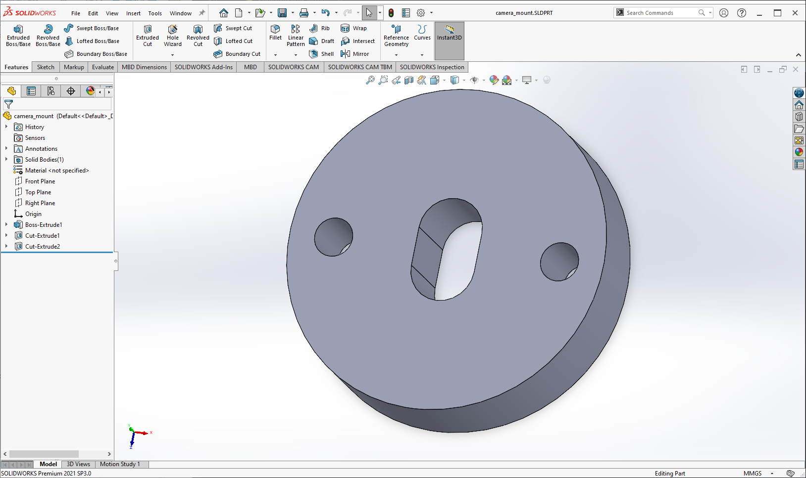

# Lab 8

> Gideon Tong (PID: A15960885)

## Tutorials

### Tutorial 1: Introduction to CAD

I'm a Solidworks user, so I used Solidworks.



> Image of my Solidworks model.

### Tutorial 2: Introduction to GPS

I learned how to grab the GPS data with geocoded data using the GPS module that we were provided. I think this is actually really cool and helps us understand how some devices like our smartphones take data from a GPS module and turns that data into something we can use in apps like Google Maps.

### Tutorial 3: Color Segmentation

I learned how we can use color tracking to run basically very fast on the Raspberry Pi where we can call the results "good enough" because the Raspberry Pi is not that powerful. It allows us to do more useful things rather than using all the procesing power for only one thing.

### Tutorial 4: Stepper Motors

My stepper motor runs and that's pretty cool! Full step turns the motor all the way and the rotorary encoder seems to allow me to accurately move the motor unlike other motors where I just have to guess based on the time that I let the motor run.

### Tutorial 5: PID Controller

I remember this from ECE 5... I actually used the same PID values as from ECE 5, which was a a Kp of 0.5, a Kd of 1e-10, and a Ki of 1e-10 (essentially zeros for D and I).

## Challenges

### Challenge 1: Final Boss

> Second video link coming when YouTube finishes processing it.


> What the page looks like.

* To run the project, connect the GPS module and camera to the default pin headers that were used in the tutorial.
* Then, in the project root folder, run the following command:

```bash
python -m venv venv
```

* Then source the environment:

```bash
source /venv/bin/activate
```

* Then install dependencies:

```bash
python -m pip install -r requirements.txt
```

* Then run lab setup in lab folder:

```bash
python setup.py
```

* Then run lab code:

```bash
python app.py
```

* Now you should be able to run the application and open the webserver. Works best without reverse websockets.
* Use over Ethernet rather than WiFi.
* No dependencies are required because MySQL was replaced with SQLite, which is inbuilt in Python.
